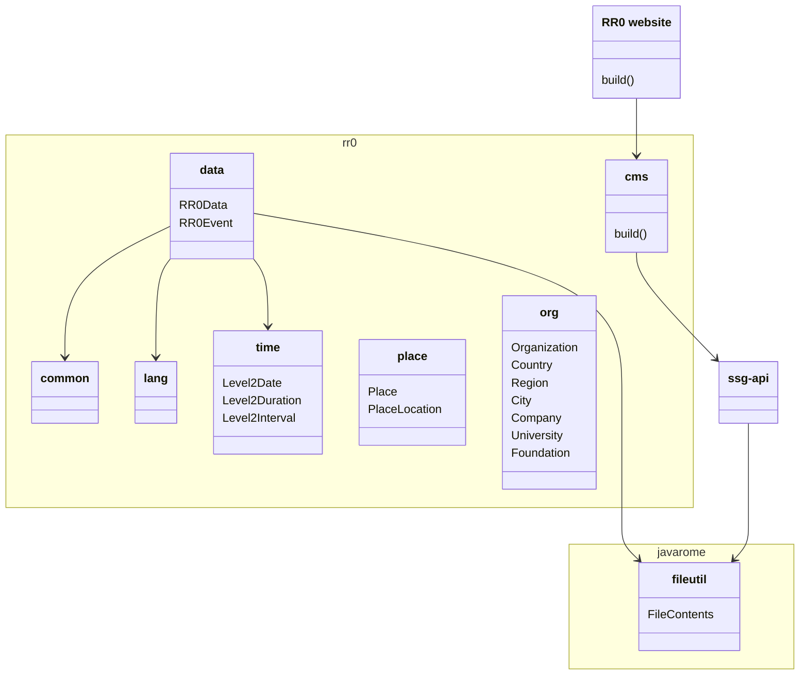

The RR0 librairies have been built to:
1. implement the [RR0 website](https://rr0.org)
2. allow others to implement their own database/website.

```mermaid
classDiagram
    class RR0["RR0 website"] {
        build()
    }
    namespace rr0 {
        class common
        class lang
        class time {
            Level2Date
            Level2Duration
            Level2Interval
        }
        class data {
            RR0Data
            RR0Event
            
        }
        class place {
            Place
            PlaceLocation
        }
        class org {
            Organization
            Country
            Region
            City
            Company
            University
            Foundation
        }
        class cms {
            build()
        }
    }
    data --> common
    data --> lang
    data --> time
    data --> fileutil
    RR0 --> cms
    cms --> ssg-api
    class ssg-api
    namespace javarome {
        class fileutil {
            FileContents
        }
    }
    ssg-api --> fileutil
```
